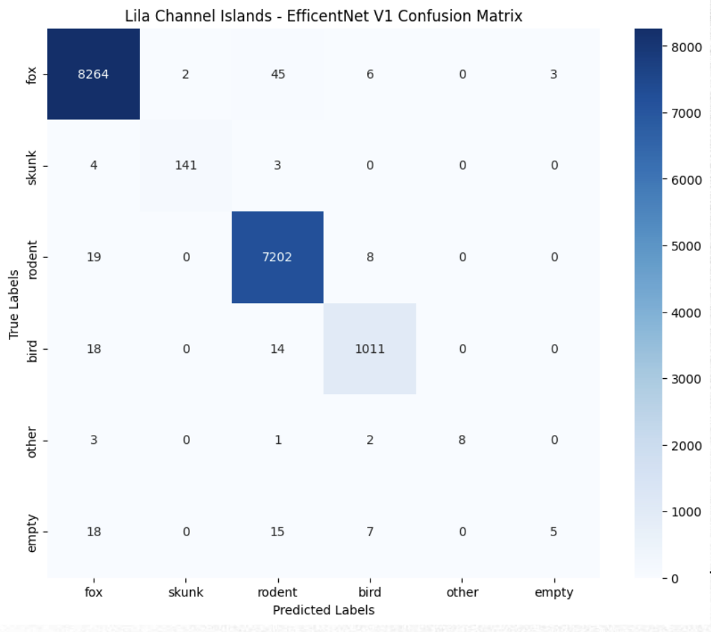

# AC297r: The Nature Conservancy Capstone Project


## Overview
Biosecurity, also known as invasive species management, is crucial for safeguarding native species and habitats especially in coastal ecosystems, which have higher rates of species extinction. Invasive species disrupt ecosystems and contribute to the decline of native species. Computer vision frameworks can be used to implement biosecurity measures with various applications such as species classification and invasive species detection.   

In this project, we plan to explore methodologies related to species classification, model interpretability, rat detection, and anomaly detection using autoencoders for invasive species detection. Our proposed frameworks aim to leverage data from real-time camera trap images of coastal ecosystems along with automated machine learning methodologies.  

This project is a collaborative effort with [The Nature Conservancy](https://www.nature.org/en-us/). The Nature Conservancy (TNC) is a globally influential environmental organization with roots dating back to its grassroots inception in the U.S. in 1951. Overall, they have more than a million members and a diverse team of over 400 scientists, TNC's conservation efforts span 79 countries and territories, directly impacting 37 of these regions and collaborating with partner organizations in 42 others. At its core, TNC is guided by a determined mission: to protect the lands and waters essential for all life. They envision a world where biodiversity flourishes, and where humanity embraces its responsibility as custodians, valuing nature for its intrinsic worth and its profound capacity to enrich our lives.

### Table of Contents
- [AC297r: The Nature Conservancy Capstone Project](#ac297r-the-nature-conservancy-capstone-project)
  - [Overview](#overview)
    - [Table of Contents](#table-of-contents)
    - [Project Organization](#project-organization)
    - [Modules](#modules)
      - [Preprocessing](#preprocessing)
      - [Species Classification](#species-classification)
      - [Rat Detection](#rat-detection)
      - [Anomaly Detection](#anomaly-detection)
  - [License](#license)
  - [Intended Contribution](#intended-contribution)
  - [Broader Impact](#broader-impact)
  - [Group Members](#group-members)

### Project Organization
```
tnc-capstone/
├── src/
│   ├── species-classification/
│   │   ├── JDLP/
│   │   │   ├── README.md
│   │   │   ├── get_bounding_boxes.ipynb
│   │   │   ├── get_cropped_images_animl.ipynb
│   │   │   ├── get_cropped_images.ipynb
│   │   │   ├── merge_data.ipynb
│   │   │   └── species_classification.ipynb   
│   │   └── lila-channel-islands/
│   │       ├── README.md
│   │       ├── Dockerfile
│   │       ├── docker-shell.sh
│   │       ├── efficientNet.ipynb
│   │       ├── get_labels.py
│   │       ├── preprocess.py
│   │       ├── requirements.txt
│   │       ├── grad-cam.ipynb
│   │       └── lila_channel_islands_efficientnet_v1.png
│   ├── anomaly-detection/
│   │   ├── README.md
│   │   ├── sci_eda/
│   │   │   ├── sci_eda_after.png
│   │   │   └── sci_eda_before.png
│   │   ├── traditional_anomaly_detection_tsne_and_accuracies/
│   │   │   ├── invasive_bat_acc.png
│   │   │   ├── invasive_bat_tsne.png
│   │   │   └── ...
│   │   ├── cae_reconstructions/
│   │   │   ├── bat_recon.png
│   │   │   ├── fox_recon.png
│   │   │   └── ...
│   │   ├── cae_anomaly_detection_tsne_and_accuracies/
│   │   │   ├── bat_acc_new.png
│   │   │   ├── bat_tsne_new.png
│   │   │   └── ...
│   │   ├── cae_for_visualization/
│   │   │   ├── recon_tsne_p5.png
│   │   │   ├── recon_tsne_p10.png
│   │   │   └── ...
│   │   ├── models/
│   │   │   ├── cae_for_visualization.h5
│   │   │   └── cae_sci_native.h5
│   │   ├── crop_images.py
│   │   ├── download_images_mod.py
│   │   ├── anomaly_detection_basic.ipynb
│   │   ├── CAE_anomaly_detection.ipynb
│   │   └── cae_for_visualizatoin.ipynb
│   ├── rat-detection/
│   │   └── model.py
│   └── secrets/
├── LICENSE
└── README.md
```

### Modules

#### Preprocessing
- Description: The `preprocess.py` script at the source level is designed to automate the cropping of images in a dataset based on the bounding boxes predicted by the MegaDetector v5b model. It is intended to be used a single time to preprocess the dataset before training the species classification models. It utilizes the Google Cloud Storage client to read and write data from Google Cloud Storage buckets. The script is multi-threaded to improve processing efficiency.

    The script reads the JSON data from Google Cloud Storage. This JSON file contains information about the images and the bounding boxes detected by MegaDetector v5b.

    For each image in the dataset, the script checks if it has already been cropped. If not, it proceeds to crop the image based on the bounding boxes with a confidence level greater than 0.90. It then uploads the cropped image to the specified output folder in Google Cloud Storage.


#### Species Classification
- Description: This module focuses on classifying species using deep learning techniques and images from camera traps in Channel Islands. The classification model is built on top of a pre-trained EfficientNetB0 model, which has been fine-tuned for this specific task. The `efficientNet.ipynb` notebook initializes and configures the model architecture, making it ready for training.

- Dataset: [Channel Islands Camera Traps](https://lila.science/datasets/channel-islands-camera-traps/). This data set contains 246,529 camera trap images from 73 camera locations in the Channel Islands, California. All animals are annotated with bounding boxes. Animals are classified as rodent (82,914), fox (48,150), bird (11,099), skunk (1,071), or other (159). 114,949 images (47%) are empty.

  - Fine-tuning subset splits:
    <center>

      |      | Train | Val  | Test  |
      | ---- | ----- | ---- | ----- |
      | Size | 58,793 | 8,400 | 16,799 |
      | Proportion | 0.67 | 0.13 | 0.20 |

    </center>
  - Class distributions:  

    <center>

    | Class  | Proportion in Split |
    | ------ | ------------------- |
    | fox    | 0.495               |
    | rodent | 0.430               |
    | bird   | 0.062               |
    | skunk  | 0.009               |
    | empty  | 0.003               |
    | other  | 0.001               |

    </center>
  
- Model Architecture

    The model architecture consists of the following components:

    1. Base Model: A pre-trained EfficientNetB0 model is loaded without its top classification layers. This serves as the backbone of the classification model. The input shape is set to (224, 224, 3) to match the expected input size for the EfficientNetB0.

    2. Fine-tuning Layers: Global average pooling is applied to the output of the base model to reduce the spatial dimensions. A dense layer with a softmax activation function is added to perform the final classification. This predicts the probabilities of each class.

    3. Unfreezing Layers: The last 20 layers (excluding batch normalization layers) of the model are unfrozen for training. This allows the model to fine-tune its parameters on the specific dataset.

- Model training:
    The model was trained for 5 epochs, on a subset of the data, and the training and test sets were split 80/20. The model was evaluated on the test set, which was not used during training. The confusion matrix below shows the model's performance on the test set.

- Preliminary Results: 
    The fine-tuning of the EfficientNet model yielded overall high accuracy results across various classes. Notably, the Fox class achieved an outstanding average test accuracy of 99.3%, followed closely by the Rodent class with an accuracy of 99.6%. The Skunk and Bird classes also demonstrated strong performance, achieving accuracies of 95.3% and 96.9% respectively. However, the model faced challenges distinguishing between the 'Other' category, achieving an accuracy of 57.1%, and the 'Empty' category, where it achieved the lowest accuracy of 11.1%. This is likely due to the fact that the 'Other' category is comprised of a wide variety of species, and the 'Empty' category is comprised of images that do not contain any animals.  
    
    <center>
    
    

    | Class  | Average test accuracy |
    | ------ | --------------------- |
    | Fox    | 99.3%                 |
    | Skunk  | 95.3%                 |
    | Rodent | 99.6%                 |
    | Bird   | 96.9%                 |
    | Other  | 57.1%                 |
    | Empty  | 11.1%                 |

    </center>

#### Rat Detection
- Description: This module is currently under development and not yet fully implemented.

#### Anomaly Detection
- Description: This module is currently under development and not yet fully implemented.


## License
This project is licensed under the MIT License - see the LICENSE file for details.

## Intended Contribution
Currently, there are no models that have been fine-tuned on high-elevation forest ecosystems that TNC can utilize. Thus, we plan on implementing species classification models for ecosystems of interests such as Maui and Kauai. Due to the nature of certain invasive species (e.g. rats, that are largely responsible for bird/reptile extinctions and that can reproduce quickly), we wish to implement a system that can provide automated alerts if a species of concern is detected allowing for prompt action. Therefore, we also plan on implementing models for invasive species classification using anomaly detection techniques and fine-tuning the MegaDetector model to specialize in rat detection. The end goal of our project is to provide models that can be integrated into the Animl platform allowing users to efficiently label their data and effectively leverage the established network of solar powered radio-connected camera traps that have been set up in hard-to-reach/challenging environments of interest. 

## Broader Impact
Developing machine learning models for invasive species detection via camera traps on islands holds significant promise for biodiversity conservation and biosecurity. It can lead to native species conservation, efficient resource allocation, early warning systems, and advances in scientific research. However, potential benefits must be balanced against ethical concerns, such as the risk of over-reliance on technology that could potentially lead to the neglect of traditional fieldwork, thereby putting native species at risk. Additionally, data bias and model transparency are critical considerations, as inaccurate results can lead to misinformed conservation strategies.Stakeholders include conservationists, researchers, government agencies, land managers, wildlife organizations, technology developers, regulatory bodies, and the general public. Each group stands to benefit from improved invasive species detection, but they also face corresponding risks if the technology fails or is exploited. The main risk is inaccurate data labeling leading to compromised ecosystem integrity (for example, false positives might result in unnecessary eradication efforts that harm non-target species, and false negatives might lead to uncontrolled population growth of invasive species). Other risks include misallocated economic and human resources, and privacy invasion in cases where camera traps are placed in areas frequented by humans. To mitigate these risks, it's crucial to implement preventive security measures and establish protocols for validating and cross-verifying the technology's results with a “human in the loop”, ensure transparency and accountability in data collection and analysis processes, as well as data anonymization if the database/models were to be made available to the public.


## Group Members
- Danhee Kim (sharonkim@g.harvard.edu)
- Isha Vaish (ishavaish@g.harvard.edu)
- Isidora Diaz (idiaz@g.harvard.edu)
- Isabella Bossa (isabellabossa@g.harvard.edu)