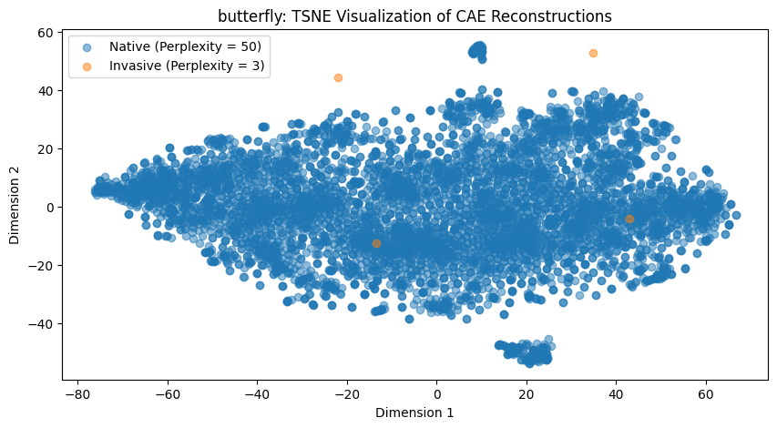

# Anomaly Detection

This module intends to explore anomaly detection methods using autoencoders for invasive
species detection. The data set used in this module is the Santa Cruz Islands camera trap
images downloaded from Animl. The 3 main methods we explore in this module are:

1. Anomaly detection using a traditional deep neural network autoencoder
2. Anomaly detection using deep convolutional autoencoders
3. Visualizing species representations using deep convolutional autoencoders and t-SNE

## Table of Contents
- [Anomaly Detection](#anomaly-detection)
  - [Table of Contents](#table-of-contents)
  - [Module Organization](#module-organization)
  - [Data Download](#data-download)
  - [Preprocessing](#preprocessing)
  - [Anomaly Detection with Traditional Autoencoders](#anomaly-detection-with-traditional-autoencoders)
  - [Anomaly Detection with Convolutional Autoencoders](#anomaly-detection-with-convolutional-autoencoders)


## Module Organization
```
tnc-capstone/
├── src/
│   ├── anomaly-detection/
│   │   ├── README.md
│   │   ├── figures_for_readme/
│   │   │   ├── traditional_autoencoder.png
│   │   │   ├── convolutional_autoencoder.png
│   │   │   └── ...
│   │   ├── sci_eda/
│   │   │   ├── sci_eda_after.png
│   │   │   └── sci_eda_before.png
│   │   ├── traditional_anomaly_detection_tsne_and_accuracies/
│   │   │   ├── invasive_bat_acc.png
│   │   │   ├── invasive_bat_tsne.png
│   │   │   └── ...
│   │   ├── cae_reconstructions/
│   │   │   ├── bat_recon.png
│   │   │   ├── fox_recon.png
│   │   │   └── ...
│   │   ├── cae_anomaly_detection_tsne_and_accuracies/
│   │   │   ├── bat_acc_new.png
│   │   │   ├── bat_tsne_new.png
│   │   │   └── ...
│   │   ├── cae_for_visualization/
│   │   │   ├── recon_tsne_p5.png
│   │   │   ├── recon_tsne_p10.png
│   │   │   └── ...
│   │   ├── models/
│   │   │   ├── cae_for_visualization.h5
│   │   │   └── cae_sci_native.h5
│   │   ├── crop_images.py
│   │   ├── download_images_mod.py
│   │   ├── anomaly_detection_basic.ipynb
│   │   ├── CAE_anomaly_detection.ipynb
│   │   └── cae_for_visualizatoin.ipynb
          
```

## Data Download
To download the Santa Cruz Islands (SCI) data from Animl, you must have an Animl
account. To download the data, follow the instructions described below. 

**Step 1:**  
First, make sure you are in the `anomaly-detection` directory. Then run the 
following in your terminal:
1. `pip install aws configure`
2. `pip install awscli`
3. `aws configure --profile animl`  
    
The third command above will prompt you for the following:
* `AWS_ACCESS_KEY_ID`
* `AWS_SECRET_ACESS_KEY`
* `DEFAULT_REGION_NAME` = `us-west-2`
* `DEFAULT_OUTPUT_FORMAT` = `text`
    
The `AWS_ACESS_KEY_ID` and `AWS_SECRET_ACCESS_KEY` were provided to us by Nathaniel
Rindlaub (nathaniel.rindlaub@tnc.org) - contact him for details.
  
**Step 2:**  
Once you have configured the AWS environment by following the steps above, follow
the instructions [here](https://github.com/tnc-ca-geo/animl-analytics). 
  
This will clone the `animl-analytics` directory into your `anomaly-detection` directory.

**Step 3:**   
To download the SCI biodiversity dataset images run the following in your terminal:
1. `cd animl-analytics`
2. `python utils/download_images.py --coco-file ../SCI_coco.json --output-dir ../images`  
    
Here, `../SCI_coco.json` is the path to the COCO json file for the SCI dataset, 
downloaded from Animl and `../images` is the path to the directory we would like
to store the images in. You can replace these with your own values.   
  
Note, the COCO json file is only for images that are human reviewed and aren't labeled `empty`, 
`person`, `vehicle`,or `animal`.  We chose these values for simplicity/data cleanliness. 
    
If it takes too long to download the images/the session crashes in the middle, 
you can run the following script instead :  
    
`python utils/download_images_mod.py --coco-file ../SCI_coco.json --output-dir ../images`
    
The script `download_images_mod.py` is a modified version of `download_images.py` that
we created to download multiple images in parallel and skip already downloaded
images. This should be faster than the original script. We have provided the 
`download_images_mod.py` file for your use. Make sure you move it into the 
`animl-analytics\utils` directory before running the above command.
    
After following the above steps, you should have a local folder containing the SCI
camera trap images.  
  
## Preprocessing
The COCO json file for the SCI data contains three fields:
1. `images`: A list where each item is a dictionary for an image with the following fields...
      * `id`: image id 
      * `file_name`: image file path
2. `annotations`: A list where each item is a dictionary for an image with the following fields...
      * `image_id`: image id same as `id` in `images`
      * `category_id`: category id of the image label, matches `id` in `categories`
      * `bbox`: coordinates for the bounding box containing the animal
3. `categories`: A dictionary with the following fields...
      * `id`: label id (ex: 1)
      * `name`: label name (ex: "scrub jay")

To get our data ready for modeling, we need to crop each image to its bounding box
as desginated by `bbox`. For convience, we created an intermediary dataset that
contains, for each image, the file path to the cropped image and image's species
label. This is csv can be created by running the following:  
  
`python crop_images.py`    
  
Running the above script should create a new directory for the cropped images, 
`cropped_images`,  and csv containing the image filepaths (`cropped_images\`+`file_name`) 
and the image labels, `sci_biodiversity_images_and_labels.csv`, in the `anomaly-detection`
directory. 
  
You can now upload the `cropped_images` folder (as a zip file) and the 
`sci_biodiversity_images_and_labels.csv` csv to Google Colab for modeling.

## Anomaly Detection with Traditional Autoencoders
The code for this section can be found in: `anomaly_detection_basic.ipynb`  
  
A traditional autoencoder has the following architecture:

Each layer is a dense layer. The main purpose of an autoencoder is to learn a 
compressed, lower dimesional repersentation of the input with unsupervised learning.
The encoder learns the lower dimensional repersentation and the decoder aims to 
reconstruct the input from the encoder's lower dimensional repersentation. During
training, the model's objective is to minimize the distance/dissimilarity between 
the input and the reconstruction.   

Autoencoders have applications in anomaly detection. You can train the autoencoder
on the majority class and use it to reconstruct the minority (anomalous) class. If
an instance's reconstruction is far from the truth then it is a member of the minority
class (is an anomaly).   
  
Although, dense layers are not the best for repersenting images. We decided to test
if we could use a traditional autoencoder for invasive species detection on the SCI images.

### Data Preprocessing
After cleaning up label typos, the species distribution for the SCI data is as follows:

Notice, how the data includes both high-level (e.g., 'rodent') and low-level names
(e.g., 'rat', 'mouse', 'vole'). For simplicity reasons, we decided to keep only the 
low-level names.  
  
Moreover, since we don't have a true invasive species, we define species with less than 
100 images to be "invasive" and the rest to be "native". Thus, our invasive species
are defined to be: ['dog', 'frog', 'bat', 'vole', 'squirrel', 'butterfly', 'snake'].
  
### Training
During the training phase, we train an autoencoder to learn a repersentation of the native species.
Then on a validation set of native species images, we can calculate the correlation between 
the autoencoder's reconstructions and the original image: `val_corr`. Since we aren't using convolutional 
autoencoders, we flatten the image before passing it into the input dense layer of our autoencoder.  
  
Due to resource constraints, we had to resize all the images to (64,64) and use a small autoencoder
architecture where the encoder and decoder each had 1 layer with 64 nodes and the bottleneck layer (center layer) had 32 nodes. Moreover, we were only able to train for 10 epochs with a small batch size of 32.  
If we had more resources, we could have a larger image size (to prevent loss of information and maintain
image quality), train for longer with a larger batch size, and expierement with larger autoencoders. 

### Inference
During the inference phase, for each invasive species image, we predict a reconstruction using the 
trained autoencoder. If the correlation between the reconstruction and the truth is less than the theshold `t`, then the image is of an invasive species. Here, $t = c * val\_corr$ where `c` is a hyper-parameter tuned
constant between 0 and 1. 
  
### Results
For all invasive species, the best value of `c` was found to be 1. Graphs plotting
the prediction accuracy by correlation threshold for each invasive species can be found
in the folder: `traditional_anomaly_detection_tsne_and_accuracies/`. In general, the 
prediction accuracies are not great with only 2 invasive species having a prediction accuracy
over 70% (buttefly and squirrel). 
  
There are multiple possible reasons for the poor perfromance: resource limitations
(small images, small batch, not enough epochs, simple model architecture), 
poor input repersentation (flattening the image doesn't best repersent the image).

To visualize the autoencoder reconstructions of the native vs invasive species images,
we used t-SNE. t-SNE stands for t-distributed Stochastic Neighbor Embedding and it is a
non-linear dimensionality reduction technique (unlike linear PCA) that can be used to 
repersent more complex structures and non-linear relationships. t-SNE defines a 
probability distribution over pairs of high-dimensional data points and a 
similar distribution over their low-dimensional counterparts. It then minimizes 
the divergence between these two distributions using a cost function. In order
to use t-SNE, you have the define a `perplexity` parameter which describes the degree
to which you want to conserve a local patterns (lower perplexity) or global patterns
(higher perplexity). Thus, t-SNE results can vary in quality depending on the `perplexity`
setting (good hyper-parameter tuning is neccessary). For simplicity, we decided to use 
$p = n-1$ as the perplexity where $n$ is the number of images for the invasive species.
  
As can be seen in the t-SNE plots below, the autoencoder does better at seperating some 
invasive species from native than others. Even though the t-SNE embeddings of the
autoencoder reconstructions of the snake images show more of a distinction than the embeddings of the
butterfly reconstructions, butterfly had a higher prediction accuracy (78%) than snake (0%). This suggests
that our threshold is not well defined. Instead of using correlation, we could use a different method. One example, would be Mean Square Error (MSE). 
  

  
  
We also tried fitting an autoencoder on all the images (native and invasive), getting the reconstructions,
and plotting them using to t-SNE to see if different species have different reconstruction patterns. The result are not that good and are given below. This could be because the autoencoder is creating too general
of a repersentation and not focusing on distinct species features.

  
  
All t-SNE plots can be found in the `traditional_anomaly_detection_tsne_and_accuracies/` folder.
  
### Recommended Future Work
1. Training
      * Longer training
      * Larger batch size
      * Use larger image resize to prevent loss of information
      * Change prediciton threshold methodology
2. Model architecture
      * Use fine-tuned pre-trained CNN to extract important image features and pass that into
      the autoencoder instead of just flattening the image
3. Visualizing species reconstructions with t-SNE
      * Hyper-parameter tune perplexity
      * Try fitting an autoencoder per species (multiple autoencoders) and plotting the reconstructions together (run t-SNE on all autoencoder reconstructions)

## Anomaly Detection with Convolutional Autoencoders
The code for this section can be found in `CAE_anomaly_detection.ipynb`.   
Convolutional Autoencoders (CAE) are similar to traditional autoencoders but they are better
suited for image data because they use CNN layers instead of dense layers. An example
architecture is given below. 
  

### Data Preprocessing
Same preprocessing as with the traditional autoencder.

### Training
We decided to start with a simple architecture. The encoder consists of 3 convolutional layers
with 3x3 kernel size, stride 2 and padding 'same' with batch norm and leaky relu layers sandwiched in between each layer. The layer sizes go from 64, 32, to 16. The decoder reverses this by using
deconvolutional layers. The reason we added batch norm and leaky relu in between each (de)convolutional layer
is because leaky relu can help with vanishing gradients (especially in deep networks) and batch norm 
is good for stabilizing and speeding up training.  
  
We trained for 10 epochs, an MSE objective, and with an image size of (224, 224). The CAE was trained
on the native images. The average MSE between the reconstructions and true images of the validation set (`mean_val_mse`) was calculated as well as the standard deviation (`sd_val_mse`) and used during inference.

The model did well in reconstructing the native and invasive species images. All reconstructions
can be found in `cae_reconstructions\`.  An example is shown below.

  

### Inference
We used the trained CAE to get reconstructions for the inasive species images. 
Then for each image, if the MSE between the reconstruction and truth was less than
the threshold `t`, the image was of an invasive species. Here the threshold is 
$t = mean\_val\_mse + k * std\_val\_mse$. Here, k is hyper-parameter tuned and takes
3 values: [1, 2, 3]. In statistics, an observation more than 3 standard deviations away
from the mean is considered an outlier. 

### Results
For all inasive species, k = 1 gave the best threshold. However, it seems that MSE threshold
was still not enough to distinguish between the native and invasive species. While dog and squirrel had 100% prediction accuracies, the remaining invasive species had accuracies less than 50% with 3 species having 0% accuracy. Even though the prediction accuracies were not good, the t-SNE plots look better than they did for the traditional autoencoder but are still better for some species than others. We also hyper-parameter tuned the perplexity for both invasive and native species. An example is given below.


  

The CAE reconstruction from the butterfly seems to show better distinction (according to t-SNE) than
the traditional autoencoder. However, the distinction is still more clear for snake than for butterfly.
  
Since the t-SNE plots seem to show some difference between the native vs invasive species reconstructions, 
it is worth it to explore other thresholds for prediction. 
