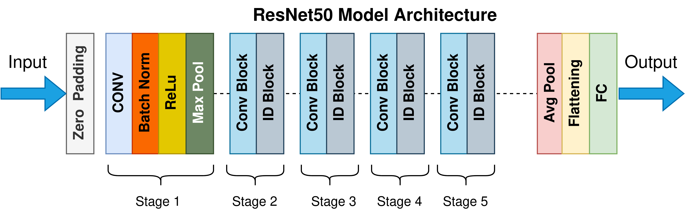
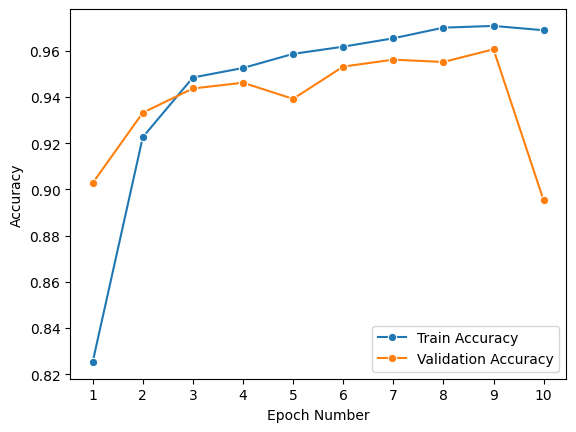
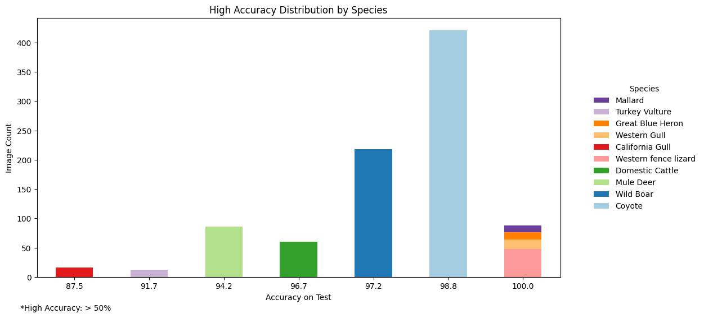
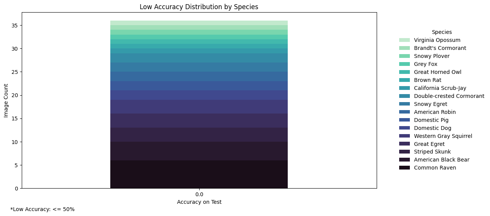
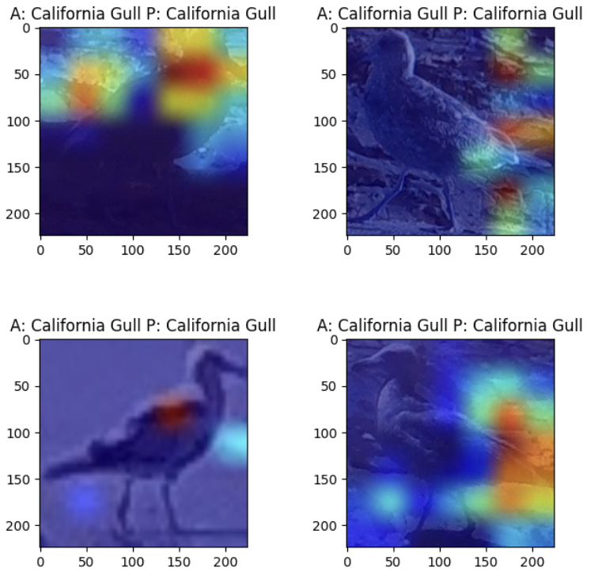

# Species Classification on LILA Channel Islands Dataset
This directory explores fine-tuning a pre-trained CNN classifier for species
classification on the Dangermond Preserve datasets, consisting of Animl and Jack and Laura Dangermond Preserve camera trap images, as well as evaluating the model's classification results 
using GRAD-CAM.

## Directory Structure
```
tnc-capstone/
├── src/
│   ├── species-classification/
│   │   └── JDLP/... 
│   │       ├── README.md
│   │       ├── get_bounding_boxes.ipynb
│   │       ├── get_cropped_images_animl.ipynb
│   │       ├── get_cropped_images.ipynb
│   │       ├── merg_data.ipynb
│   │       ├── requirements.txt
│   │       ├── species_classification.ipynb
│   │       └── figures/
```

### Data
The JLDP dataset is derived from two distinct camera trap sources. The first source involves The Nature Conservancy's (TNC) platform Animl, containing 4,970 images that were annotated through a multistep process, utilizing MegaDetector, computer annotations, and a "human in the loop" approach for comprehensive and accurate identification of species. The second source, Wildlife Insights, has a total of 14,233 human-annotated images stored in an S3 bucket.


### Pre-Processing: Wildlife Insights

- `get_bounding_boxes.ipynb`
- `get_cropped_boxes.ipynb`
  
There was a multi-step pre-processing performed on the data. First, MegaDetector was run on the Wildlife Insights images, identifying animals in them and obtaining the corresponding bounding boxes. Only detections where MegaDetector was more than 45\% confident of its findings were kept. There were 86,525 images of which 36,857 were either empty or did not meet the confidence threshold.

There were also 24,365 labels corresponding to 24,213 images. Out of these, 14,233 were human-reviewed. The remaining labels had initially been identified using computer vision. However, upon further examination, they were found to have some clear misclassifications. This discovery led us to the decision to proceed exclusively with human-reviewed labels.

When merging the 14,233 labels with the 49,668 cropped images, there was some data loss resulting from images with more than one animal present (where it was impossible to tell which annotation belonged to which species without manually observation), labels for pictures where MegaDetector did not confidently detect the animals present even though human reviewers had identified the labels, and images without human-reviewed labels.

After all the cleaning and pre-processing, the resulting dataframe contained 9,251 images with human-reviewed annotations. It should be noted, however, that a few data issues persisted for these images, such as the bounding boxes found by MegaDetector not being exact (and thus incorporating a larger part of the background).

### Pre-Processing: Animl

- `get_cropped_images_animl.ipynb`

The AniML dataset contained the images, bounding box coordinates and labels in the same place, so no merging was necessary.

In total, there were 4,970 images belonging to 12 classes. Some of the labels, however, were too general (e.g., animal, bird, rodent), did not make sense (e.g., boyco), belonged to non-animal entities (e.g., person) or contained multiple species (e.g., pig appeared to have images of both domestic pigs and wild boars), and so the corresponding images were removed from the dataset.

There were also several additional issues: the coordinates of some bounding boxes were negative, the width and height of some bounding boxes were 0 and some images included labels but not bounding boxes. After performing data remediation on these, there remained 2,675 pictures in the  dataset.


### Merging both Datasets

- `merge_data.ipynb`

The two dataframes, Wildlife Insights and AniML, were merged to obtain a final one with 11,926 images belonging to 33 species.  The is overall a marked class imbalance, with some species like Black Phoebe and House Finch being represented by just a single image and others like Coyote containing 5,409 ones.

To address the class imbalance and because model performance for species with a small number of images might be negatively impacted, the four species with 5 or less images were removed from the dataset, resulting in a total of 29 classes instead of 33.

### Model Training

- `species_classification.ipynb`

We fine-tuned Keras' ResNet-50 by initially loading the model with pre-trained weights. Following this, the first layers are frozen, specifically customizing the last 30 layers (excluding the top). To augment the model's generalization capability, we extend its architecture with a global average pooling layer and introduce a dropout layer for regularization.



Further customization includes the addition of a Dense layer at the output, with softmax activation function. To optimize the model for training, it is compiled using the Adam optimizer with a learning rate set at 0.0001. The choice of categorical cross entropy as the loss function ensures effective training for a multi-class classification task, with accuracy serving as the primary metric for model evaluation.

### Results
We find a progressive increase in validation accuracy until reaching 9 epochs, at which point there is a steep decrease. At epoch 10, the validation accuracy (96.05%) is almost 7 percentage points lower than that of epoch 9 (89.52%), while the training accuracy remains very high (96.88%), suggesting that the model starts to overfit.



Since we did not observe large differences in  accuracy between epochs 6 (96.17% training accuracy and 95.31% validation accuracy) and 9 (97.07% training accuracy and 96.06% validation accuracy), we ran subsequent models for 6 epochs due to capacity constraints.

The final model is thus run with 30 trainable layers for 6 epochs, achieves a test accuracy of 95.13%. When calculating accuracy at the species level, however, we found significant differences across different classes. Almost all of the species containing 10 or more images presented a relatively high accuracy (above 90%), but those with very few observations reached sometimes a 0% accuracy in test.





### Model Interpretability

The California Gull class is the only category exhibiting accuracy below 90%, despite having a training dataset of more than 10 images. This makes it interesting to analyze using Grad-CAM.

We find that even for images that were correctly classified, the model tends to focus more on the background than on the bird itself, with a tendency to emphasize elements such as weed and sticks near the gull's legs. This phenomenon is discernible through the heightened saliency of gradients, as depicted in the red and yellow heatmap areas. To address this issue, one potential solution is to train the model on images where the background has been removed, or narrowing the bounding boxes before cropping. Another option is to create synthetic images featuring the same species on different backgrounds, which would additionally increase training sample size, providing an alternative approach for evaluation and improvement. These are all avenues for future work.

